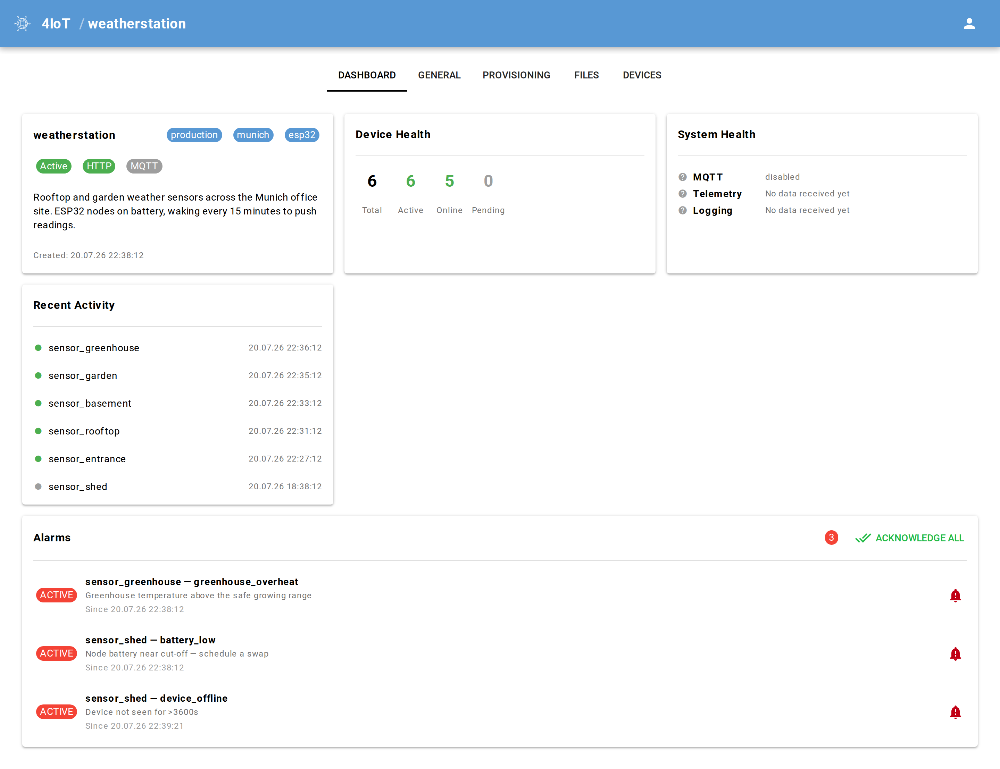
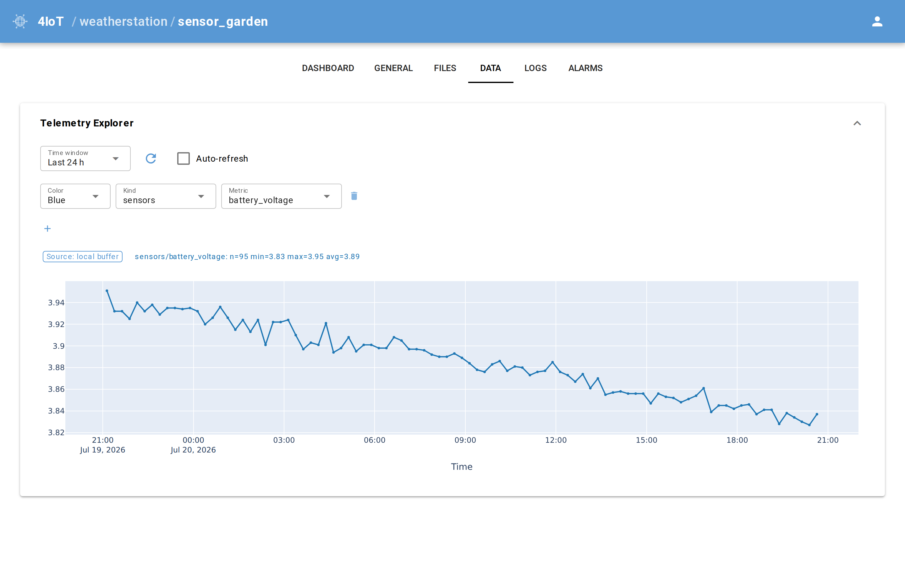
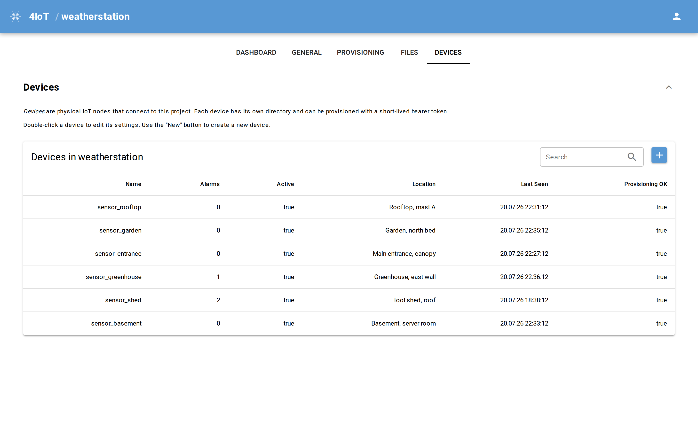
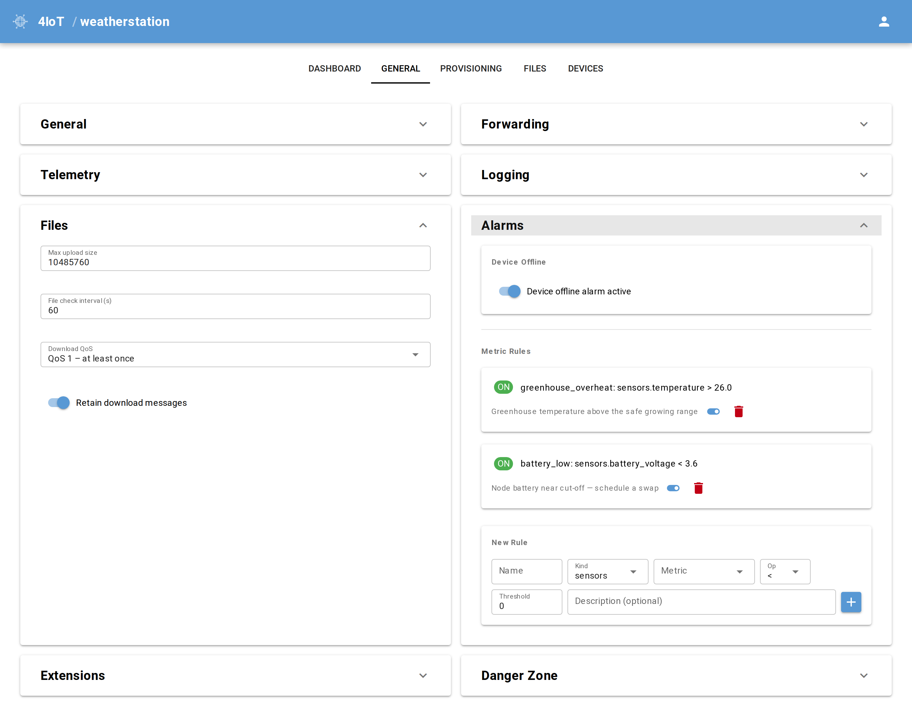

# nice4iot

An IoT device management platform written in Python. It provides a REST API for devices and a web-based management UI, both served from a single process — no database, no message queue, no external services required to get started.

<p align="center">
  
</p>

## Contents

- [Features](#features)
- [Quick Start](#quick-start)
- [Screenshots](#screenshots)
- [Tech Stack](#tech-stack)
- [Documentation](#documentation)
- [Deployment](#deployment)
- [Open Questions / TODO](#open-questions--todo)
- [Contributing](#contributing)
- [Licence](#licence)

---

## Features

- **Project & device management** — organise devices into projects, manage metadata and lifecycle via a web UI
- **Token-based provisioning** — devices self-register using a project-scoped provisioning token and receive a short-lived device token in return
- **Telemetry ingestion & charting** — devices push measurements; nice4iot forwards them to a time-series backend (Prometheus remote write or InfluxDB line protocol) and always stores the last 2 000 readings locally. The Data tab charts directly from the configured backend (long history) and falls back to the local ring buffer when none is set up. Recommended backend: [VictoriaMetrics](https://victoriametrics.com) via the Prometheus backend — `push_url: http://host:8428/api/v1/write`, `pull_url: http://host:8428/api/v1/`
- **Log ingestion** — devices push log lines; nice4iot forwards them to a log backend (Loki or local file); the UI shows a live tail of the file log
- **HTTP forwarding** — authenticated devices can proxy arbitrary requests through the platform to configured backend URLs
- **File serving & upload** — devices can fetch and upload files; device-specific files take precedence over project-wide defaults (ETag caching supported)
- **Auto-generated UI** — forms and tables are derived from Pydantic models via [niceview](https://github.com/clausgf/niceview), keeping model and UI in sync without boilerplate
- **Alarm system** — per-project alarm rules (metric thresholds + built-in device-offline rule); state-based with acknowledgment; alarm panels on project and device dashboards
- **System health** — project dashboard shows live green/red status for MQTT, telemetry, and logging backends; external-call errors are captured without raising exceptions
- **Extensions** — separately deployed packages can add their own REST endpoints, MQTT pub/sub, and UI cards/tabs, and get notified when a new device is provisioned; see [docs/extensions.md](docs/extensions.md)
- **Admin UI authentication** — optional, pluggable (`none`/`proxy`/`password`), disabled by default

### Management UI tabs

| Page | Tabs |
|---|---|
| Projects list | — card grid |
| Project | Dashboard · General · Provisioning · Files · Devices |
| Device | Dashboard · General · Files · Data · Logs · Alarms |

---

## Quick Start

Requires Python 3.12+ and [uv](https://docs.astral.sh/uv/).

```bash
git clone https://github.com/clausgf/nice4iot.git
cd nice4iot
uv sync
mkdir -p data/projects
uv run uvicorn app.main:app --reload --port 8000
```

Open <http://localhost:8000> for the management UI, or <http://localhost:8000/docs> for the interactive API documentation. Create a project, generate a provisioning token under **Provisioning**, then simulate a device without any hardware:

```bash
uv run python tools/device_client.py cycle \
    --url http://localhost:8000 --project myproject --device mydevice \
    --token <provisioning_token> \
    --sensors '{"temperature": 22.4, "humidity": 60}' --log "Device started"
```

For running it as a service, see [Deployment](#deployment). For development details, see [docs/development.md](docs/development.md).

---

## Screenshots

**Telemetry Explorer** — the device Data tab charts directly from the configured backend, falling back to the local ring buffer (shown here) when none is set up.

<p align="center">
  
</p>

**Device table** — every device in a project with its live status, location, last-seen time, and active-alarm count.

<p align="center">
  
</p>

**Alarm rules** — per-project metric thresholds and the built-in device-offline rule; forms are generated from the Pydantic models via niceview.

<p align="center">
  
</p>

---

## Tech Stack

| Layer | Technology |
|---|---|
| Web framework | [FastAPI](https://fastapi.tiangolo.com) |
| Web UI | [NiceGUI](https://nicegui.io) (Quasar/Vue under the hood) |
| Data modelling | [Pydantic v2](https://docs.pydantic.dev) |
| UI generation | [niceview](https://github.com/clausgf/niceview) (custom library) |
| Telemetry backends | [Prometheus](https://prometheus.io) remote write · [InfluxDB](https://influxdata.com) line protocol |
| Log backends | [Grafana Loki](https://grafana.com/oss/loki/) · rotating file |
| Persistence | Filesystem (JSON files + JSONL) |
| Package management | [uv](https://docs.astral.sh/uv/) |
| Runtime | [uvicorn](https://www.uvicorn.org) |
| Deployment | Docker / Docker Compose |

FastAPI and NiceGUI share a single uvicorn process via `ui.run_with(app, ...)`. The REST API is reachable at `/api/*`; the NiceGUI UI occupies all other paths via `ui.sub_pages`.

---

## Documentation

Full documentation lives in [docs/](docs/README.md):

| Document | Contents |
|---|---|
| [What is an IoT manager?](docs/what-is-an-iot-manager.md) | The problem nice4iot solves, for readers new to the category |
| [Core Concepts](docs/concepts.md) | Data storage, token model, device lifecycle, alarms, system health |
| [Device API Reference](docs/device-api.md) | The REST contract devices depend on, plus the device simulator |
| [Configuration](docs/configuration.md) | Environment variables and UI authentication |
| [MQTT Support](docs/mqtt.md) | Topic layout, file delivery, broker settings |
| [Architecture](docs/architecture.md) | Module layout and the design decisions behind it |
| [Extensions](docs/extensions.md) | Adding endpoints, MQTT handlers, and UI from a separate package |
| [Development](docs/development.md) | Setup, running from source, tests, linting |
| [Deployment](deploy/README.md) | Container image and Docker Compose examples |

---

## Deployment

A container image and a Docker Compose example live in [`deploy/`](deploy/):

```bash
cd deploy
mkdir -p data                # once, owned by your user
docker compose up -d --build
```

The example runs nice4iot behind an external reverse proxy (it joins a `proxy` Docker network and only `expose`s port 8080 internally). See [deploy/README.md](deploy/README.md) for the details — **including the security note to read before exposing nice4iot to a network**, serving under a sub-path, and the epaper extension (built in by default).

---

## Open Questions / TODO

- **Forwarding security** — forwarding strips the `Authorization` header but forwards all other client headers verbatim; review whether this is appropriate for all backends.
- **Multi-user / RBAC** — all UI operators share the same access level.
- **Backup and restore** — no tooling or documentation for backup, restore, or migration of the `data/projects/` directory.
- **Pagination** — project and device lists load all items into memory; large deployments will need pagination.
- **Telemetry read from InfluxDB** — the Data tab reads from Prometheus-compatible backends (Prometheus, VictoriaMetrics, Mimir) with local fallback; a read path for the InfluxDB line-protocol backend (InfluxQL/Flux) is not implemented.
- **MQTT device commands** — `{base}/cmd/{name}` downlink topic for server-to-device commands is planned.
- **MQTT authentication** — currently managed by the broker. A future version will integrate with Mosquitto's Dynamic Security Plugin for per-device credential provisioning from the UI.

---

## Contributing

Issues and pull requests are welcome — see [CONTRIBUTING.md](CONTRIBUTING.md) for the development setup and the project rules enforced in review. For security issues please use [private reporting](SECURITY.md) rather than a public issue.

---

## Licence

nice4iot is licensed under the **GNU Affero General Public License v3.0 or later** (AGPL-3.0-or-later). The full text is in [LICENSE](LICENSE).

In short: you may use, modify, and redistribute it, provided derivative works stay under the same licence. The AGPL additionally covers network use — **if you run a modified version as a service that others interact with over a network, you must offer them its source code.** Running an unmodified nice4iot for your own devices carries no such obligation; the UI links to this repository from the user menu.
